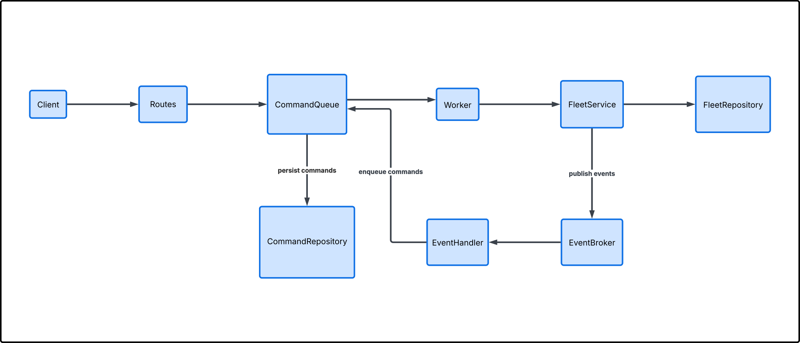
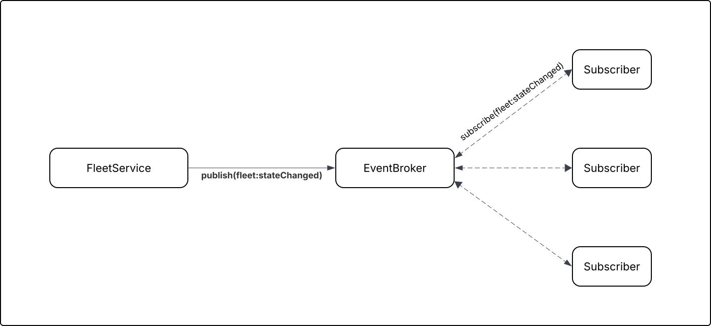
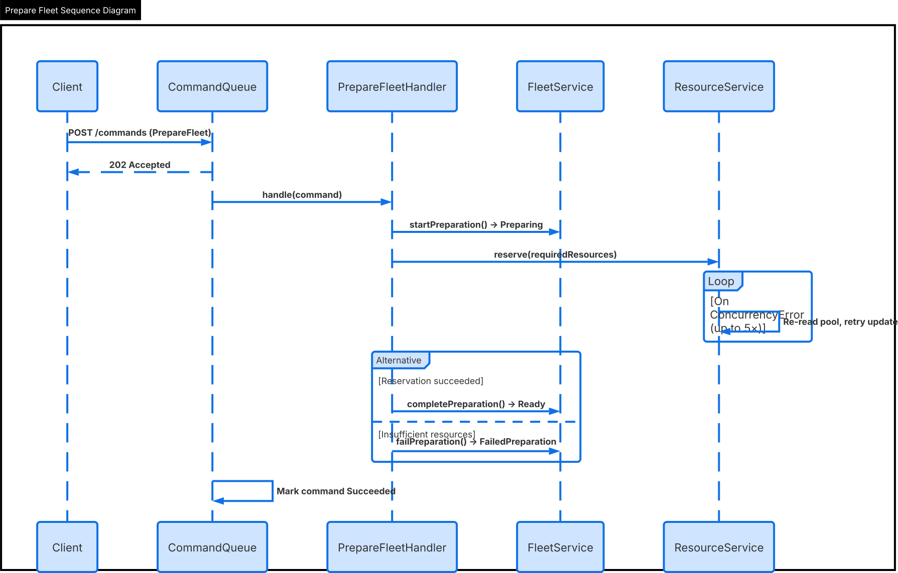

# Table of Contents

- [Running Locally](#running-locally)
  - [Project Structure](#project-structure)
- [Architecture](#architecture)
  - [Domain Model](#domain-model)
- [Concurrency Strategy](#concurrency-strategy)
- [Idempotency Strategy](#idempotency-strategy)
- [Command Queue](#command-queue)
- [Battle Resolution](#battle-resolution)
- [Production Improvements](#production-improvements)
  - [ETags for API Concurrency](#etags-for-api-concurrency)
  - [Persistence](#persistence)
  - [Command Queue](#command-queue-1)
  - [Concurrency in a Distributed System](#concurrency-in-a-distributed-system)

# Running Locally

### Install and start

```bash
npm install
npm run dev        # hot-reload dev server on port 3000
# or
npm run build && node dist/index.js
```

### Run tests

```bash
npm test
npm test -- --coverage   # with coverage report
```

### Sample run
```bash
npx ts-node scripts/demo-battle.ts
```

[Click here](./COMMANDS.md) for more details on running commands.

## Project structure

```
src/
  index.ts                    # Entry point
  app.ts                      # Express app factory; wires all components
  persistence/
    types.ts                  # VersionedEntity, error types
    InMemoryRepository.ts     # Generic repository with optimistic locking
    fleetRepository.ts        # Fleet entity (ships, resources, timeline)
    commandRepository.ts      # Command entity
    resourcePoolRepository.ts # ResourcePool with getByType()
    battleRepository.ts       # Battle entity
    context.ts                
  domain/
    fleet/
      stateMachine.ts         # Valid transitions, InvalidTransitionError
      FleetService.ts         # Fleet mutations (createFleet, startPreparation, etc)
    resources/
      ResourceService.ts      # Concurrency-safe reservation with retry
    battle/
      BattleMatchmaker.ts     # Matchmaking pool with optimistic locking
      BattleResolver.ts       # Score-based battle resolution with randomness
  commands/
    types.ts                  
    CommandQueue.ts           # Enqueue, optimistic claim, retry, post-processing hooks
    createCommandQueue.ts     # Factory — registers command handlers
    handlers/
      PrepareFleetHandler.ts  # Fleet-first ordering + idempotency fence
      DeployFleetHandler.ts   # Idempotency fence
      StartBattleHandler.ts   # Transitions both fleets, creates battle record
      ResolveBattleHandler.ts # Resolves battle, transitions to terminal states
  routes/
    battleRoutes.ts           # GET /battles, GET /battles/:id
    commandRoutes.ts
    fleetRoutes.ts
    resourceRoutes.ts
```

# Architecture
Galactic Fleet Command is an event-driven strategy platform. Factions assemble fleets, prepare them by reserving scarce galaxy-wide resources, deploy them on missions, and battle other fleets. The system is designed so that real infrastructure (database, message broker) can be swapped in without changing domain logic.

**Key system properties:**
- Concurrency-safe resource reservation
- Commands — CommandQueue processes async commands (PrepareFleet,  etc) with optimistic claim, retry with backoff, and idempotency fences in each handler
- Events — Typed EventBroker (Node.js EventEmitter) decouples command handlers from follow-up logic. Fleet transitions emit fleet:stateChanged; the queue emits command:succeeded/failed
- Persistence — Generic InMemoryRepository<T> with optimistic locking

### High level


### Events


### Preparation Sequence



## Domain model
### Fleet
```
Fleet
├── id: string                              (identity)
├── version: number                         (optimistic lock)
├── name: string
├── state: FleetState                       (FSM state)
├── ships: Ship[]                          
├── requiredResources: ResourceRequirement  
├── reservedResources: ResourceRequirement  (set on Ready)
├── timeline: FleetEvent[]                  (append-only event log)
```

### Resource pool
```
ResourcePool
├── id: string
├── version: number
├── resourceType: ResourceType   (FUEL | HYPERDRIVE_CORE | BATTLE_DROIDS)
├── total: number                (fixed capacity)
└── reserved: number             (sum of all active reservations)
```

### Command
```
Command
├── id: string
├── version: number
├── type: CommandType            (PrepareFleet | DeployFleet)
├── status: CommandStatus        (Queued | Processing | Succeeded | Failed)
├── payload: Record              (command-specific parameters)
├── idempotencyKey: string       (client-provided deduplication key)
├── attemptCount: number
├── createdAt: string
├── processedAt?: string
└── error?: string
```

# Concurrency strategy
**Problem:** Multiple requests may attempt to reserve the same resource pool simultaneously. Without coordination, two commands reading `available = 10` could each reserve 8, producing a total reservation of 16.
 
 > **Note: Node.js is single-threaded.** The only moment two async operations can interleave is when one of them hits an `await` and yields control back to the event loop.

**Approach: Optimistic Locking**

Resource reservation uses **optimistic locking** (version field on every entity):

1. Read the resource pool and its current version.
2. Compute the new reserved amount.
3. Call `repo.update(id, expectedVersion, updater)` — throws `ConcurrencyError` if another writer incremented the version first.
4. On `ConcurrencyError`, retry up to 5 times with a fresh read.

 **Why I chose optimistic locking:** Making the assumption that conflicts in our system are rare (few concurrent commands targeting the same fleet),
  retries are cheap (in-memory reads), and it maps directly to production databases (Cosmos _etag, PostgreSQL
  rowVersion) with zero domain code changes. The main trade-off is no cross-entity atomicity, we handle with fleet-first ordering and idempotency fences rather than transactions

**Alternatives:**
- Transactional boundary: Was not considered as this project uses an in-memory data store that does not support transactions and Node.js has no transactional support. In short - too complicated for this project.
- Saga: This could have been an option, specially since transactions were not an option, but the complexity of the compensating logic seemed hard to get right for the timeline, like handling failures of the compensation step.

# idempotency Strategy
**Problem:** A command worker may crash after partially executing a command but before marking it Succeeded. On restart, the command is re-queued and executed again. This must not double-reserve resources or double-transition fleet state.

**Approach: idempotency Key.**
We use commandId as an idempotency key. ResourceReservationService tracks which (commandId, resourceType) pairs have been successfully reserved. On retry, already-reserved pairs are skipped.


1. **Command lifecycle guard** — Before executing a command, check its `status`. If it is already `Succeeded`, return the result immediately without re-executing. This is the primary idempotency gate.

2. **State-based guards in handlers** — Each command handler checks the current fleet state before applying transitions. `PrepareFleetCommandHandler` checks that the fleet is still `Docked` before transitioning to `Preparing`; if it is already `Preparing` or `Ready`, it infers prior partial execution and continues from where it left off. **Confirmed behaviour:** submitting a `PrepareFleet` command for a fleet already in `Preparing` or `Ready` is treated as idempotent — the command succeeds without re-applying side effects.

3. **Resource reservation fence** — `ResourceReservationService` tracks which `(commandId, resourceType)` pairs have been successfully reserved. On retry, already-reserved pairs are skipped.

Re-submitting the same logical command is always safe.

# Command queue
Fleet operations like resource reservation and deployment are "workflow steps" — they may fail, need retries, and shouldn't block the HTTP response. POST /commands returns 202 Accepted immediately; the queue processes it asynchronously.

  Command lifecycle:
  Queued → Processing → Succeeded | Failed

**Approach:**

  1. Enqueue — API creates a Command entity with status Queued and adds its ID to a pending list
  2. Optimistic claim — Worker attempts Queued → Processing via version-checked update. If another worker claimed it
  first (ConcurrencyError), skip it
  3. Handler dispatch — The queue looks up the registered handler by command type and calls handle(command, services)
  4. Retry with backoff — On ConcurrencyError, retry up to 3 times with delays of [0ms, 100ms, 500ms]
  5. Outcome — Mark the command Succeeded or Failed and publish the result to the EventBroker

  Event-driven chaining:

  Handlers don't enqueue follow-up commands directly. Instead, the EventBroker wires automation listeners that react to
  outcomes:

  - DeployFleet success → fleet:stateChanged → matchmaker adds fleet to pool → if pair found, enqueue StartBattle
  - StartBattle success → command:succeeded → enqueue ResolveBattle


- `DeployFleet` success → add fleet to matchmaker pool → if pair found, enqueue `StartBattle`
- `StartBattle` success → enqueue `ResolveBattle`

# Battle Resolution

Score formula: `(sum(reservedResources) + 50) * random[0.5, 1.5)`. The base of 50 ensures even resource-poor fleets have a chance. The fleet with higher resources wins *most* battles but not all.

# Production Improvements
## Persistence

Swap `InMemoryRepository` for a database-backed implementation. The optimistic locking pattern (`version` field, `ConcurrencyError` on mismatch) maps directly to:

- **PostgreSQL**: Use a `version` column; `UPDATE ... WHERE id = $1 AND version = $2` returns 0 rows on conflict → throw `ConcurrencyError`
- **Azure Cosmos DB**: Use the built-in `_etag` field; pass `If-Match` header on writes → 412 on conflict

No domain code changes required, only the repository implementations change.

## Command Queue
Replace with a durable message broker:

- **Azure Service Bus / RabbitMQ / SQS**: Commands become messages on a queue. Multiple worker instances compete to consume them. The broker handles delivery guarantees, dead-letter queues, and retry policies.
- **Dead-letter queue**: After N failed attempts, move the command to a DLQ for manual inspection instead of silently dropping it.

The idempotency fence in each handler remains critical — brokers guarantee *at-least-once* delivery, so handlers must tolerate duplicates.

## Concurrency in a Distributed System
This project assumes low contention. In production, different  strategies may need to be considered.

### Resource reservation
In a production environment, we may want to enforce an all-or-nothing strategy when reserving resources. If multiple resources are needed to build a ship, getting a partial amount might be a waste of money. In this case two strategies would be considered that were previously mentioned: **Saga and transactional boundaries**.

Here's a table that compares the two strategies

| | Transactional Boundary | Saga Pattern |
  |---|---|---|
  | **Atomicity** | All-or-nothing, enforced by the database | Eventual — achieved through compensating actions |
  | **Isolation** | Full — intermediate state invisible to other readers | None — each step commits immediately and is visible |
  | **Consistency** | Immediate — guaranteed at commit | Eventual — consistent only after all steps or compensations complete |
  | **Scope** | Single database/service | Cross-service, cross-database |
  | **Rollback** | Automatic — database discards uncommitted changes | Manual — you write and maintain compensating actions for every step |
  | **Failure handling** | Simple — transaction fails, nothing happened | Complex — compensation can itself fail, leaving partial state |
  | **Concurrency** | Database locks prevent conflicts during transaction | No built-in protection — concurrent sagas can interleave and conflict |
  | **Performance** | Holds locks for duration — blocks other writers | Non-blocking between steps — higher throughput for independent operations |
  | **Coupling** | Requires all entities in the same database | Works across independent services and databases |
  | **Complexity** | Low — wrap operations in `BEGIN/COMMIT` | High — N steps means N compensating actions and N failure scenarios to test |
  | **Best when** | Entities are in the same database and consistency is critical | Operations span multiple services where a single transaction is impossible |

  Whether entities live in the same database, contention levels, performance requirements and consistency requirements would be the top criteria. I would probably start with **transactional boundaries**.


### ETags for API Concurrency

Currently, optimistic concurrency is handled via a `version` field in the request body. In production, this should use HTTP ETags:

- `GET /fleets/:id` returns `ETag: "v3"` header
- `PATCH /fleets/:id` requires `If-Match: "v3"` header
- Returns `412 Precondition Failed` on version mismatch

This follows HTTP semantics and works naturally with caches and CDNs.

## Caching
Caching Layers

1. Application-level cache  
  Best for: Fleet read models, resource pool availability, command status lookups.
   - Redis — supports expiration, pub/sub for invalidation, Lua scripts for atomic operations
   - Cache-aside pattern: read from cache first, fall back to DB, populate cache on miss
   - Write-through or write-invalidate on mutations

2. HTTP caching (CDN / reverse proxy)  
  Best for: Read-heavy endpoints like GET /fleets/:id, GET /resources.
   - Use Cache-Control headers with short TTLs (e.g., 5-30s)
   - ETags for conditional requests. Aligns with current ETag strategy
   - CDN edge caching for geographically distributed clients
## Other Production Considerations

| Concern | Current | Production |
|---|---|---|
| Observability | `console.log` | Structured logging (pino), metrics (Prometheus), tracing (OpenTelemetry) |
| Auth | None | JWT / API key middleware |
| Rate limiting | None | Express rate limiter middleware |